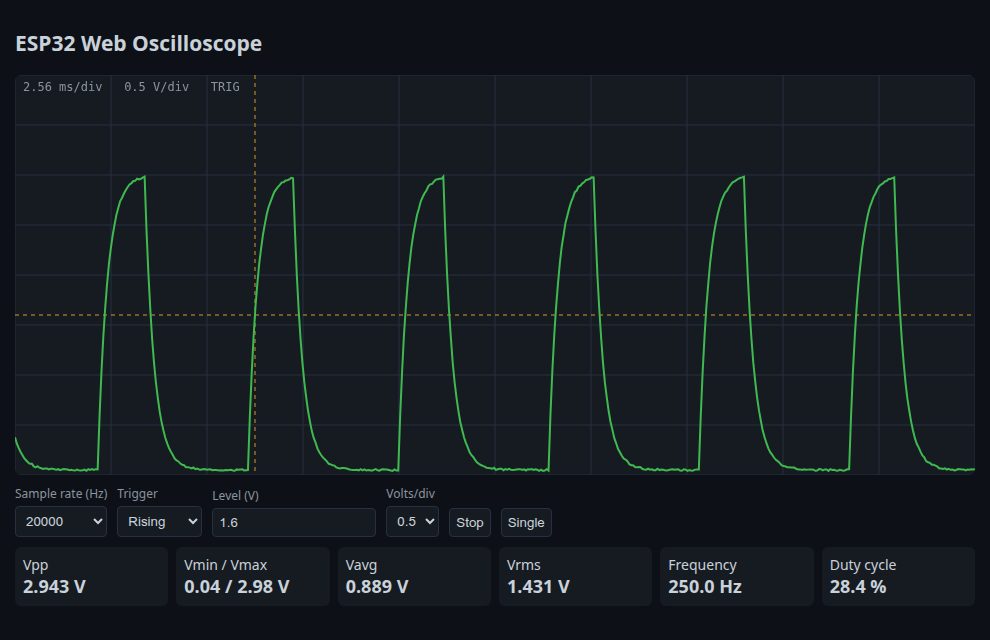

# ESP32 Web Oscilloscope


A single-channel digital oscilloscope built from an ESP32 and a browser. The firmware samples an analog input at up to 50 kS/s, finds an edge trigger in a ring buffer with pre-trigger history, and serves each frame as JSON. A self-contained web page, served by the ESP32 itself, draws the trace on a graticule and computes the usual measurements.

It turns a few dollars of hardware into a usable teaching instrument for audio-frequency signals, PWM outputs, RC charge curves and 555 timer circuits.



*The browser interface served by the firmware. For this image the page from `src/web_ui.cpp` was rendered with a simulated capture (250 Hz PWM through an RC filter) in place of the ESP32; the measurements are computed by the page itself. Regenerate with `python docs/make_screenshot.py`.*

## Features

- Paced sampling from 100 S/s to 50 kS/s with 12-bit resolution
- Rising, falling or free-run trigger with hysteresis and adjustable level
- 25 % pre-trigger: the display shows what happened before the trigger point
- Auto mode: a frame is still returned when no trigger occurs within 250 ms
- Browser UI: run, stop and single-shot capture, volts per division, trigger level marker
- Automatic measurements: Vpp, Vmin, Vmax, Vavg, Vrms, frequency and duty cycle
- Built-in 1 kHz square wave on GPIO25 to check the probe and the display
- Works on an existing Wi-Fi network, or as its own access point with no router at all
- No external libraries: only the Arduino-ESP32 core (`WebServer`, `WiFi`)

## Hardware

| Signal | ESP32 pin | Notes |
| --- | --- | --- |
| Probe input | GPIO34 (ADC1_CH6) | 0 to about 3.1 V with 11 dB attenuation |
| Calibration output | GPIO25 | 1 kHz, 50 % square wave |
| Ground | GND | Common with the circuit under test |

### Input front end

The ADC accepts 0 to 3.1 V only. To measure other signals, add a front end:

```
            R1 100k
 Probe ────/\/\/───┬───────── GPIO34
                   │
                  R2 47k       (divide by about 3.1: 0 to about 9.5 V range)
                   │
 Vbias 1.55 V ─────┘  (optional: bias to mid-scale for AC signals,
                       with a 1 uF coupling capacitor in series with the probe)
```

Clamp diodes to GND and 3.3 V protect the input from overvoltage. Never connect the ESP32 to mains-referenced circuits.

## Getting started

```bash
git clone https://github.com/GUELORD-MWENDERWA/esp32-web-oscilloscope.git
cd esp32-web-oscilloscope
cp include/secrets.example.h include/secrets.h   # optional: set your Wi-Fi network
pio run -t upload
pio device monitor
```

The serial monitor prints the address to open. Without `secrets.h`, connect to the `ESP32-Scope` access point (password `scope1234`, change it in `include/config.h`) and browse to `http://192.168.4.1/`.

To check the setup, connect GPIO34 to GPIO25: the display shows a 1 kHz square wave with a duty cycle close to 50 %.

### Prebuilt firmware

Each [release](https://github.com/GUELORD-MWENDERWA/esp32-web-oscilloscope/releases/latest) contains `esp32-web-oscilloscope-esp32dev.bin`, a single image (bootloader, partition table and application) for any ESP32 DevKit. Flash it without installing PlatformIO:

```bash
pip install esptool
esptool.py --chip esp32 --port /dev/ttyUSB0 write_flash 0x0 esp32-web-oscilloscope-esp32dev.bin
```

From a browser, the same file can be flashed at offset `0x0` with the [ESP Tool web flasher](https://espressif.github.io/esptool-js/).

## HTTP API

`GET /capture?rate=<Hz>&edge=<rising|falling|none>&level=<0-4095>`

```json
{"rate": 20000, "triggered": true, "samples": [2048, 2051, ...]}
```

Each response holds 512 raw 12-bit samples. The browser converts them to volts, so the same endpoint can feed a Python script or a data logger.

## Architecture

```
src/
  main.cpp      Wi-Fi (station or access point), HTTP routes, calibration output
  sampler.cpp   Paced ADC sampling, ring buffer, trigger detection with hysteresis
  web_ui.cpp    Single-page oscilloscope UI stored in flash
include/
  config.h      Pins, frame size, rate limits, access point settings
```

Sampling runs in a tight loop paced by `micros()` while the HTTP request waits. This is deliberate: `analogRead()` is not safe to call from a timer interrupt on the Arduino-ESP32 core, and the request is blocked until the frame is ready anyway.

## Limitations

- The ESP32 ADC is non-linear near 0 V and above about 3 V; readings are indicative, not calibrated.
- Wi-Fi interrupts add a few microseconds of sampling jitter, visible at 50 kS/s.
- Usable bandwidth is roughly 10 to 20 kHz (Nyquist limit plus the front end).

## Roadmap

- Continuous DMA sampling through the I2S peripheral for rates above 100 kS/s
- Second channel on GPIO35
- FFT view for spectrum analysis

## Status

The firmware compiles for the ESP32 DevKit (`espressif32@6.10.0`, Arduino core 2.0.x). It has not yet been validated on hardware; measurements and timing figures above are design targets.

## License

MIT. See [LICENSE](LICENSE).
